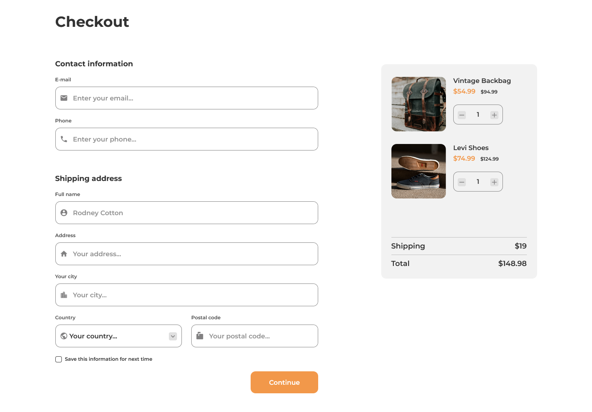

# Dev Challenges - Checkout page

This is a solution to the [Checkout page challenge on Dev Challenges](https://devchallenges.io/challenges/0J1NxxGhOUYVqihwegfO). Challenge: Create a checkout page following the design. You don’t need to use JS in this challenge but use correct input types and validation.

Fulfill user stories below:

- User story: I can see a page following the given design
- User story: I can input email, phone, full name, address, city, country, and postal code
- User story: I can input the number of items
- User story: I can select at least 3 countries from the dropdown
- User story: When I click submit button or press enter, I can see a warning if validation fails
- User story: When I click submit button or press enter, I can see a successful alert if validation succeeds

## Table of contents

- [Overview](#overview)
  - [The challenge](#the-challenge)
  - [Screenshot](#screenshot)
  - [Links](#links)
- [My process](#my-process)
  - [Built with](#built-with)
- [Author](#author)

## Overview

### Screenshot

### Links

- Solution URL: [Repo](https://github.com/karinaestaba/checkout-page.git)
- Live Site URL: [Demo](https://karinaestaba.github.io/checkout-page)

## My process

### Built with

- Semantic HTML5 markup
- CSS custom properties
- Flexbox, CSS GRID
- Sass

## Author

- Website - [Karina Estaba]
- Dev Challenges - [@karinaestaba](https://devchallenges.io/portfolio/karinaestaba)
